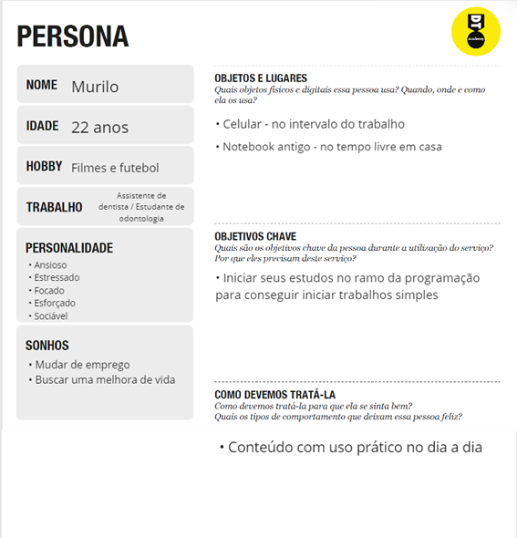
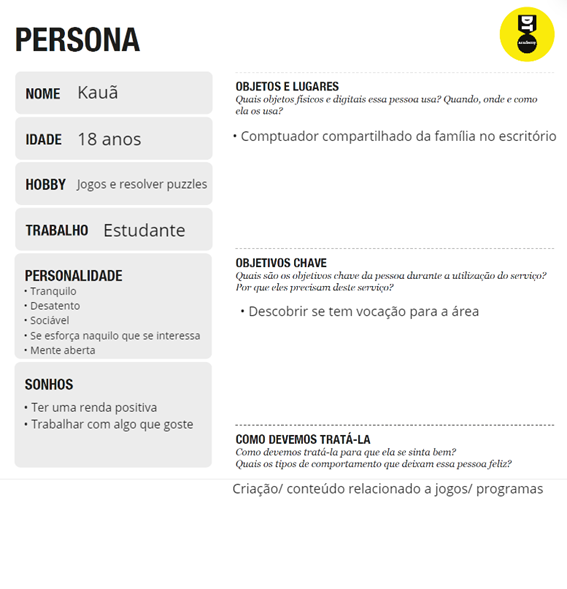
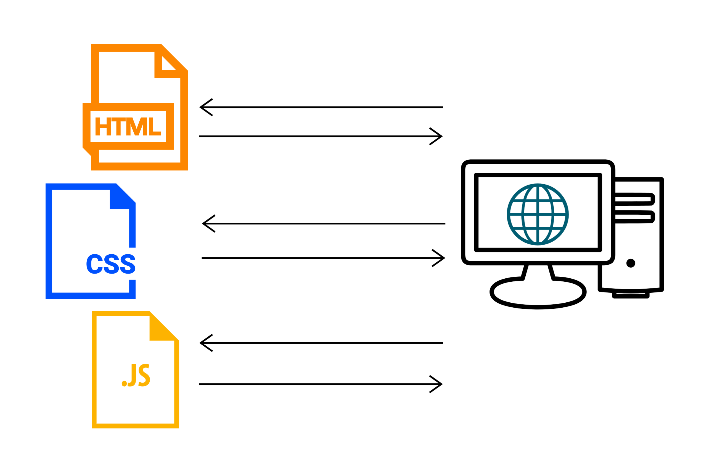
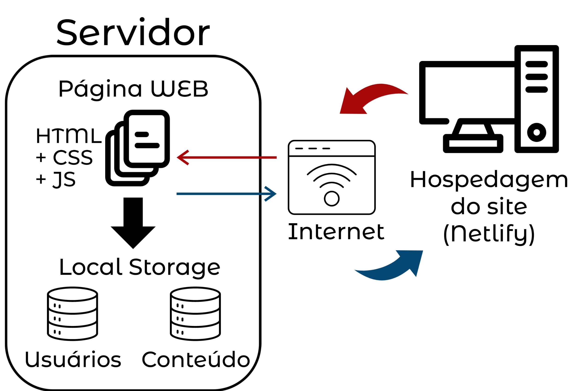

# <a name = "informações-do-projeto"><a/> 📝 Informações do Projeto

`TÍTULO DO PROJETO`
   
   EasyCode

`CURSO` 

   Ciência da Computação - disciplina trabalho interdisciplinar de aplicações web

##  <a name = "participantes"><a/> 👤 Participantes

   - André Menezes Resende

   - Camila Viana Dolabela
    
   - Clara Oliveira Mello Monteiro

#  <a name = "estrutura-do-documento"><a/> 📃 Estrutura do Documento

- [Informações do Projeto](#informações-do-projeto)
  - [Participantes](#participantes)
- [Estrutura do Documento](#estrutura-do-documento)
- [Introdução](#introdução)
  - [Problema](#problema)
  - [Objetivos](#objetivos)
  - [Justificativa](#justificativa)
  - [Público-Alvo](#público-alvo)
- [Especificações do Projeto](#especificações-do-projeto)
  - [Personas e Mapas de Empatia](#personas-e-mapas-de-empatia)
  - [Histórias de Usuários](#histórias-de-usuários)
  - [Requisitos](#requisitos)
    - [Requisitos Funcionais](#requisitos-funcionais)
    - [Requisitos não Funcionais](#requisitos-não-funcionais)
  - [Restrições](#restrições)
- [Projeto de Interface](#projeto-de-interface)
  - [User Flow](#user-flow)
  - [Wireframes](#wireframes)
- [Metodologia](#metodologia)
  - [Divisão de Papéis](#divisão-de-papéis)
  - [Ferramentas](#ferramentas)
  - [Controle de Versão](#controle-de-versão)
- [**############## SPRINT 1 ACABA AQUI #############**](#-sprint-1-acaba-aqui-)
- [Projeto da Solução](#projeto-da-solução)
  - [Tecnologias Utilizadas](#tecnologias-utilizadas)
  - [Arquitetura da solução](#arquitetura-da-solução)
- [Avaliação da Aplicação](#avaliação-da-aplicação)
  - [Plano de Testes](#plano-de-testes)
  - [Ferramentas de Testes (Opcional)](#ferramentas-de-testes-opcional)
  - [Registros de Testes](#registros-de-testes)
- [Referências](#referências)

# Introdução
   
   A programação é o processo de escrita, teste e manutenção de um programa de computador. Desenvolvida primeiramente na década de 30, atualmente é composta por diversas linguagens que são constituídas de comandos, que quando utilizados corretamente, executam uma ação.
   
  Tendo em vista a complexidade da linguagem de programação, foi pensado um programa/ website que ameniza as dificuldades iniciais de alguém que busca aprender a programar. Nesse documento é registrado os passos principais para a realização desse projeto.

## Problema

Para estudantes de programação, um dos principais recursos utilizados para realizar seus estudos são locais de pesquisa e aprendizado sobre as diversas linguagens utilizadas na área.
   
Entretanto, ao pesquisar na internet por tais locais, dificilmente serão encontrados conteúdos que além de gratuitos, também sejam de qualidade.
   
Além do mais, um programador iniciante usualmente possui dificuldade em entender certos termos técnicos utilizados por programadores mais experientes, o que dificulta na procura de soluções para algum erro de código, ou no entendimento da solução em sí.

## Objetivos

Nesse projeto, o principal objetivo será suprir parte da falta de conteúdo gratuito sobre programação, além de descomplicar o entendimento de programadores iniciantes sobre a área.
   
Para isso, um site será construído que objetiva auxiliar o estudante em sua pesquisa e lhe ajudar caso ocorrer dúvidas.
   
Uma área do site dedicada a responder perguntas básicas e pré-selecionadas será criada para auxiliar o estudante que ainda está iniciando na área e não possui conhecimento prévio algum.
   
Ademais, além de seu próprio conteúdo, o site também irá guiar e indicar o estudante a fontes confiáveis e de qualidade, para que possa expandir suas pesquisas além do escopo determinado do site.

## Justificativa

Como programadores iniciantes, nossa entrada na área da programação iniciou-se com um grande bloqueio, sendo essa não só a falta de conteúdo gratuito de qualidade, mas também a dificuldade de entender textos sobre linguagens e soluções para eventuais erros.
   
Ademais, durante a realização de uma pesquisa de campo, foi se percebido que esse problema não atingia apenas a nós, mas também a diversas outras pessoas que entrevistamos.
   
E por fim, vimos que diversos estudantes até sabiam onde procurar por soluções para seus erros ou conteúdos didáticos da área, mas que frequentemente eram feitos com linguagem rebuscada e confusa para iniciantes.
   
Portanto, o tema foi escolhido de forma a tentar solucionar essa situação, que assola não só os próprios membros do grupo, mas também diversos outros estudantes.

## Público-Alvo

O público-alvo escolhido serão pessoas de qualquer gênero, entre 16 e 26 anos, que já são familiarizados com tecnologia, e possuem interesse, mas não possuem experiência ou conhecimento algum na área da programação.
 
# Especificações do Projeto

A seguir há uma sequência de passos que ajudaram no entendimento das necessidades do público alvo e, então, 
no desenvolvimento de pequenos objetivos que atendem cada demanda apresentada.

Para conseguir realizar as especificações com mais clareza, ulizou-se a plataforma Miro (miro.com)

## <a name = "personas-e-mapas-de-empatia"><a/> 👥 Personas e Mapas de Empatia

 - ### Murilo

 - ### Vitória
  

 - ### Kauã

Com as personas e os mapas 
de empatia, foi possível compreender possíveis problemas de usuários e determinar quais funções do 
programa são essenciais ou não (requisitos funcionais e não funcionais).

## <a name = "histórias-de-usuários"><a/> 📚 Histórias de Usuários

Com base na análise das personas foram identificadas as seguintes histórias de usuários:

|EU COMO... `PERSONA`| QUERO/PRECISO ... `FUNCIONALIDADE` |PARA ... `MOTIVO/VALOR`                 |
|--------------------|------------------------------------|----------------------------------------|
|Murilo       | Aprender programação                  | Conseguir trabalhos simples e aumentar a renda |
|Vitória      | Direcionamento na área de programação | Conseguir aprofundar seus conhecimentos por conta própria |
|Kauã         | Conhecer mais sobre programação       | Descobrir se possui vocação/ interesse |

## <a name = "requisitos"><a/> ✔️ Requisitos

As tabelas que se seguem apresentam os requisitos funcionais e não funcionais que detalham o escopo do projeto.

### Requisitos Funcionais

|ID    | Descrição do Requisito  | Prioridade |
|------|-----------------------------------------|----|
|RF-001| Conteúdos de qualidade | ALTA | 
|RF-002| Criação de perfis para colaboradores   | MÉDIA |
|RF-003| Indicações de materiais e sites | MÉDIA |
|RF-004| Criação do layout padrão | ALTA |
|RF-005| Login e cadastro de usuários | MÉDIA |
|RF-006| Página de edição para colaboradores | MÉDIA |

### Requisitos não Funcionais

|ID     | Descrição do Requisito  |Prioridade |
|-------|-------------------------|----|
|RNF-001| Responsividade | MÉDIA |
|RNF-002| Produção de um QUIZ | BAIXA |

## <a name = "restrições"><a/> ⛔ Restrições

O projeto está restrito pelos itens apresentados na tabela a seguir.

|ID| Restrição                                             |
|--|-------------------------------------------------------|
|01| O projeto deverá ser entregue até o final do semestre |
|02| Não pode ser desenvolvido um módulo de backend        |
|03| Conhecimento sobre linguagens de programação limitado |

# Projeto de Interface

Primeiramente, foi criado o userflow visando atender os requisitos/ demandas descritas
anteriormente. Dessa forma, foram criadas áreas para conteúdo, exercício e exemplos. Além da possibilidade
de haver contribuidores que poderão alimentar a plataforma.

A partir do userflow, foi possível produzir os wireframes, que possuem a base do layout de todas as páginas do site.

## <a name = "user-flow"><a/> 🌐 User Flow

## <a name = "wireframes"><a/> 🖥️ Wireframes

 - Wireframe completo

Páginas mais relevantes: 

 - Página inicial

 - Página que corresponde à biblioteca de linguagens disponíveis

 - Modelo da página com conteúdo sobre determinada linguagem

# Metodologia

Com o objetivo de entender o problema em tese e em como ele afeta a sociedade, 
foi utilizado o processo de Design Thinking, que consiste em analisar o problema através dos pilares de 
empatia, colaboração e experimentação. Para completar, foi utilizado o Scrum com o intuito de dividir as 
tarefas e responsabilidades para agilizar o processo de realização dos afazeres.

A divisão de papéis ficou centrada em desenvolver os frameworks em equipe e depois separar a construção do site, 
a documentação do projeto e a montagem da apresentação.

As ferramentas utilizadas foram plataformas de softwares, como GitHub e Figma, e plataformas de criação de documentos, 
como o PDF e PowerPoint.  

## <a name = "divisão-de-papéis"><a/> 🗂️ Divisão de Papéis

|ID     | Descrição do Requisito  |Pessoa |
|-------|-------------------------|-------|
|RF-001| Conteúdos de qualidade | Camila/ Clara | 
|RF-002| Criação de perfis para colaboradores   | André/ Camila |
|RF-003| Indicações de materiais e sites | Camila/ Clara |
|RF-004| Criação do layout padrão | Clara |
|RF-005| Login e cadastro de usuários | André/ Camila |
|RF-006| Página de edição para colaboradores | André |
|RNF-001| Responsividade | Clara |
|RNF-002| Produção de um QUIZ | André |

## <a name = "ferramentas"><a/> 🔧 Ferramentas

| Ambiente  | Plataforma              |Link de Acesso |
|-----------|-------------------------|---------------|
|Processo de Design Thinkgin  | Miro |  https://miro.com/app/board/uXjVOBuAT1c=/ | 
|Protótipo Interativo | Figma | https://www.figma.com/proto/Li6r3MoMW3qB5ZfKhj0gX2/TIAW?node-id=2%3A31&scaling=min-zoom&page-id=0%3A1&starting-point-node-id=2%3A31 | 
|Wireframe | Figma | https://www.figma.com/file/Li6r3MoMW3qB5ZfKhj0gX2/TIAW?node-id=0%3A1 |
|Repositório de código | GitHub | https://github.com/ICEI-PUC-Minas-PPLCC-TI/tiaw-ppl-cc-m-20221-t1g7 | 
|User flow | Wireflow | https://wireflow.co/ |
|Divisão de tarefas | Trello | https://trello.com/b/fExRjgSD/tiaw |
|Hospedagem do site | Netllify |  https://easycode-tiaw2022.netlify.app/ | 

## <a name = "controle-de-versão"><a/> 🗃️ Controle de Versão

Até o momento, não foi utilizado nenhuma ferramenta de versionamento. Está sendo utiliazado
o Github para a hospedagem do repositório e nele são feitas as mudanças da documentação.
   
Com o objetivo de garantir que todos os membros estão de acordo com as mudanças a serem
realizadas, é criado um branch (ou mais, dependendo da necessidade) que é implementado
somente após a aprovação do grupo.

> Discuta como a configuração do projeto foi feita na ferramenta de
> versionamento escolhida. Exponha como a gerência de tags, merges,
> commits e branchs é realizada. Discuta como a gerência de issues foi
> realizada.
> A ferramenta de controle de versão adotada no projeto foi o
> [Git](https://git-scm.com/), sendo que o [Github](https://github.com)
> foi utilizado para hospedagem do repositório `upstream`.
> 
> O projeto segue a seguinte convenção para o nome de branchs:
> 
> - `master`: versão estável já testada do software
> - `unstable`: versão já testada do software, porém instável
> - `testing`: versão em testes do software
> - `dev`: versão de desenvolvimento do software
> 
> Quanto à gerência de issues, o projeto adota a seguinte convenção para
> etiquetas:
> 
> - `bugfix`: uma funcionalidade encontra-se com problemas
> - `enhancement`: uma funcionalidade precisa ser melhorada
> - `feature`: uma nova funcionalidade precisa ser introduzida
>
> **Links Úteis**:
> - [Tutorial GitHub](https://guides.github.com/activities/hello-world/)
> - [Git e Github](https://www.youtube.com/playlist?list=PLHz_AreHm4dm7ZULPAmadvNhH6vk9oNZA)
> - [5 Git Workflows & Branching Strategy to deliver better code](https://zepel.io/blog/5-git-workflows-to-improve-development/)
>
> **Exemplo - GitHub Feature Branch Workflow**:
>
> 

# **############## SPRINT 1 ACABA AQUI #############**

# Projeto da Solução

O projeto da solução começou com a divisão de tarefas entre a equipe.  Como o projeto é criar um site, cada integrante ficou encarregado de desenvolver uma parte: a página inicial, o conteúdo e o login. A funcionalidade do site se baseia em ter um pequeno resumo sobre cada linguagem de programação e quem tem o perfil acessível por login, é capaz de modificar o texto e criar novos tópicos.

## Tecnologias Utilizadas

Para a organização do projeto como um todo foi utilizado ferramentas como:
   - Miro: facilitador para organização de ideias e para definições de público alvo e de objetivo principal
   - Figma: utilizado para definir a ideia base de como o site seria apresentado ao usuário
   - WireFlow: organização do fluxo do usuário pelo site
   - Trello: organização das tarefas a serem realizadas
   - Netlify: meio pelo qual o site consegue ser disponibilizado ao público
   - VSCode Studio: auxiliador no desenvolvimento do código

Linguagens utilizadas:
   - HTML
   - CSS
   - JavaScript
   
 
   
   Legenda: as três principais partes que compõem a página web (HTML, CSS e JavaScript)

> Descreva aqui qual(is) tecnologias você vai usar para resolver o seu
> problema, ou seja, implementar a sua solução. Liste todas as
> tecnologias envolvidas, linguagens a serem utilizadas, serviços web,
> frameworks, bibliotecas, IDEs de desenvolvimento, e ferramentas.
> Apresente também uma figura explicando como as tecnologias estão
> relacionadas ou como uma interação do usuário com o sistema vai ser
> conduzida, por onde ela passa até retornar uma resposta ao usuário.
> 
> Inclua os diagramas de User Flow, esboços criados pelo grupo
> (stoyboards), além dos protótipos de telas (wireframes). Descreva cada
> item textualmente comentando e complementando o que está apresentado
> nas imagens.

## Arquitetura da solução

   
   O computador à direita representa o meio pelo qual o usuário conseguirá acessar o site criado, no caso, foi utilizado o Netlify para a hospedagem. Primeiramente, o cliente, através da internet, realiza uma requisição ao servidor. O servidor acessará o conteúdo da página web (arquivos HTML, CSS e JavaScript) além do LocalStorage - nesse projeto foi utilizado dois conjuntos de armazenamento de dados: um para cadastro de usuários e outro para cadastro de conteúdo. Após concluir a captura dos dados, o servidor gerará uma resposta que será enviada ao browser do cliente. Assim, o site é carregado no navegador.

# Avaliação da Aplicação

Os cenários que serão testados são o de cadastro de perfil, login de perfil, que se espera resultar na página de perfil do usuário e poder modificar o conteúdo, e o quiz, que se espera apresentar perguntas para o usuário e responder uma linguagem baseado nas respostas escolhidas.

> Apresente os cenários de testes utilizados na realização dos testes da
> sua aplicação. Escolha cenários de testes que demonstrem os requisitos
> sendo satisfeitos.

## Plano de Testes

Teste 1: Cadastrar
•	Entrar na parte Contribua no site
•	Clicar em criar conta
•	Preencher os campos
•	Clicar em continuar
•	Após logado no perfil, a pessoa tem permissão de modificar os tópicos das linguagens
Teste 2: Login
•	Entrar na parte Contribua no site
•	Preencher os campos
•	Clicar em continuar
•	Após logado no perfil, a pessoa tem permissão de modificar os tópicos das linguagens
Teste 3: Quiz
•	Clicar no banner do quiz
•	Responder as perguntas
•	Irá aparecer uma linguagem como resultado

> Enumere quais cenários de testes foram selecionados para teste. Neste
> tópico o grupo deve detalhar quais funcionalidades avaliadas, o grupo
> de usuários que foi escolhido para participar do teste e as
> ferramentas utilizadas.
> 
> **Links Úteis**:
> - [IBM - Criação e Geração de Planos de Teste](https://www.ibm.com/developerworks/br/local/rational/criacao_geracao_planos_testes_software/index.html)
> - [Práticas e Técnicas de Testes Ágeis](http://assiste.serpro.gov.br/serproagil/Apresenta/slides.pdf)
> -  [Teste de Software: Conceitos e tipos de testes](https://blog.onedaytesting.com.br/teste-de-software/)

## Ferramentas de Testes (Opcional)

......  COLOQUE AQUI O SEU TEXTO ......

> Comente sobre as ferramentas de testes utilizadas.
> 
> **Links Úteis**:
> - [Ferramentas de Test para Java Script](https://geekflare.com/javascript-unit-testing/)
> - [UX Tools](https://uxdesign.cc/ux-user-research-and-user-testing-tools-2d339d379dc7)

## Registros de Testes

Todos os testes obtiveram os resultados esperados e sem falhas. O site apresenta estar todo funcional e pronto para ser divulgado para o público. Mas para versões futuras, um tópico que é desejado para adicionar é exercícios de cada linguagem e a possibilidade de correção.

> Discorra sobre os resultados do teste. Ressaltando pontos fortes e
> fracos identificados na solução. Comente como o grupo pretende atacar
> esses pontos nas próximas iterações. Apresente as falhas detectadas e
> as melhorias geradas a partir dos resultados obtidos nos testes.

# Referências

FLAMMO, Equipe. Persona e público-alvo: qual a diferença no marketing? Flammo, 2016. Disponível em: https://flammo.com.br/blog/persona-e-publico-alvo-qual-a-diferenca/. Acesso em: Abril/2022

REHKOPF, Max. Histórias de usuários com exemplos e um template. Atlassian. Disponível em: https://www.atlassian.com/br/agile/project-management/user-stories. Acesso em: Abril/2022

SANTOS, Larissa dos. Como escrever boas histórias de usuário (User Stories). Medium, 2017. Disponível em: https://medium.com/vertice/como-escrever-boas-users-stories-hist%C3%B3rias-de-usu%C3%A1rios-b29c75043fac Acesso em: Abril/2022

CANGUÇU, Rafael. O que são Requisitos Funcionais e Requisitos Não Funcionais? Codificar, 2021. Disponível em: https://codificar.com.br/requisitos-funcionais-nao-funcionais/. Acesso em: Abril/2022

ALFF, Chico. O que são Requisitos Funcionais e Não Funcionais? Análise de requisitos, 2022. Disponível em: https://analisederequisitos.com.br/requisitos-funcionais-e-nao-funcionais/. Acesso: Abril/2022

FARIAS. Gabriel Sa. Fluxo de usuário (User Flow): O que é? Como fazer?. Medium, 2018. Disponível em: https://medium.com/7bits/fluxo-de-usu%C3%A1rio-user-flow-o-que-%C3%A9-como-fazer-79d965872534. Acesso em: Abril/2022

Mockplus. Top 25 User Flow Tools & Templates for Smooth UX. Mockplus, 2019. Disponível em: https://www.mockplus.com/blog/post/user-flow-tools. Acesso em: Abril/ 2022

PACIEVITCH, Yuri. História da Programação. Infoescola. Disponível em: https://www.infoescola.com/informatica/historia-da-programacao/. Acesso em: Abril/2022
